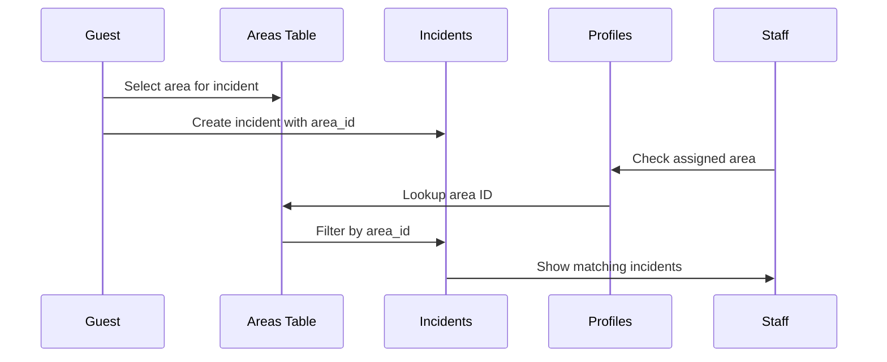

The `areas` table stores department/area definitions used to categorize incidents and assign them to appropriate staff members.

## Table Name

`areas`

## Schema Fields

<ParamField path="id" type="uuid" required>
  Primary key, automatically generated
</ParamField>

<ParamField path="name" type="text" required>
  Area/department name (e.g., "mantenimiento", "limpieza", "cocina")
  
  Used for both incident categorization and staff area assignments.
</ParamField>

<ParamField path="created_at" type="timestamp">
  Automatically set when the area is created
</ParamField>

## Relationships

- **incidents**: One-to-many relationship (one area can have many incidents)
- **profiles**: Logical relationship via `profiles.area` field (string match)

## Common Area Types

Typical areas in a hotel incident management system:

<ResponseField name="mantenimiento" type="Maintenance">
  Handles repairs, HVAC issues, plumbing, electrical problems
</ResponseField>

<ResponseField name="limpieza" type="Housekeeping">
  Handles cleaning requests, towel/linen issues, room supplies
</ResponseField>

<ResponseField name="cocina" type="Kitchen">
  Handles food service, room service, dietary concerns
</ResponseField>

<ResponseField name="recepción" type="Front Desk">
  Handles check-in/out issues, billing, general inquiries
</ResponseField>

## Query Examples

### Load All Areas

Fetch available areas for incident creation form:

```typescript
const { data, error } = await supabase
  .from("areas")
  .select("id, name")
  .order("name");
```

**Source:** `mobile/components/CreateIncidentForm.tsx:86`

This populates the area dropdown when guests report incidents:

```typescript
type Area = {
  id: string;
  name: string;
};

const [areas, setAreas] = useState<Area[]>([]);
```

### Find Area by Name

Lookup area ID for staff member's assigned area:

```typescript
const { data: profile } = await supabase
  .from("profiles")
  .select("area")
  .eq("id", userId)
  .single();

const { data: areaData } = await supabase
  .from("areas")
  .select("id")
  .eq("name", profile.area)
  .single();
```

**Source:** `mobile/components/EmpleadoBuzonIncidents.tsx:199`

### Get Area Name from Incident

Fetch incident with related area information:

```typescript
const { data, error } = await supabase
  .from("incidents")
  .select(`
    id,
    title,
    description,
    areas(name)
  `)
  .eq("id", incidentId)
  .single();

console.log(data.areas.name); // "mantenimiento"
```

**Source:** `mobile/components/MyIncidentsView.tsx:108`

### Load Area-Filtered Incidents

Staff members see only incidents for their area:

```typescript
const { data: incidents, error } = await supabase
  .from("incidents")
  .select(`
    id, 
    title, 
    description, 
    priority, 
    status, 
    created_at,
    areas(name), 
    rooms(room_code)
  `)
  .eq("area_id", areaId)
  .eq("status", "pendiente")
  .order("created_at", { ascending: false });
```

**Source:** `mobile/components/EmpleadoBuzonIncidents.tsx:207`

## Area Assignment Flow



## Data Model

```typescript
interface Area {
  id: string;         // UUID
  name: string;       // e.g., "mantenimiento"
  created_at: string; // ISO timestamp
}
```

**Source:** `mobile/components/CreateIncidentForm.tsx:27`

## Display Format

Area names are stored in lowercase but displayed with proper capitalization:

```typescript
const displayName = area.name.charAt(0).toUpperCase() + area.name.slice(1);
// "mantenimiento" → "Mantenimiento"
```

**Source:** `mobile/components/CreateIncidentForm.tsx:207`

## Integration with Staff Profiles

Staff members are assigned to areas via the `profiles.area` field:

```typescript
// Create staff member
await supabase.from("profiles").insert({
  id: userId,
  email: "staff@hotel.com",
  full_name: "Staff Member",
  role: "empleado",
  area: "mantenimiento", // Links to areas.name
});
```

When the staff member logs in:

```typescript
// Get user's area
const { data: profile } = await supabase
  .from("profiles")
  .select("area")
  .eq("id", userId)
  .single();

// Find area ID
const { data: areaData } = await supabase
  .from("areas")
  .select("id")
  .eq("name", profile.area)
  .single();

// Query incidents for that area
const { data: incidents } = await supabase
  .from("incidents")
  .select("*")
  .eq("area_id", areaData.id);
```

## Best Practices

<Tip>
  - Keep area names consistent and lowercase for easier matching
  - Use descriptive names that staff and guests can understand
  - Create areas before adding staff members
  - Avoid renaming areas once incidents are assigned
</Tip>

<Warning>
  The `profiles.area` field stores the area name as a string, not a foreign key. Ensure area names match exactly between tables.
</Warning>

## Related Tables

<CardGroup cols={2}>
  <Card title="Incidents" icon="triangle-exclamation" href="/api/incidents">
    Incidents categorized by area
  </Card>
  <Card title="Users" icon="user" href="/api/users">
    Staff members assigned to areas
  </Card>
</CardGroup>
