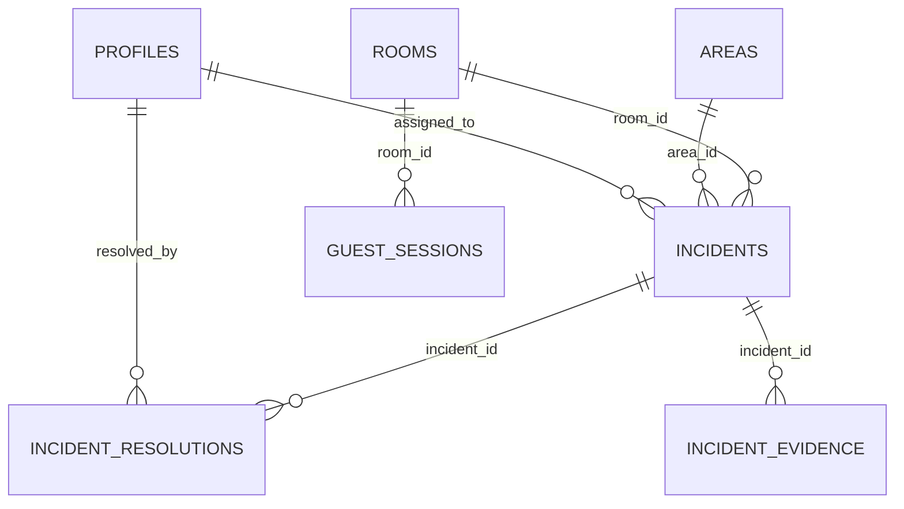

The Incidents App uses Supabase (PostgreSQL) as its database backend. The schema is designed to support a hotel incident management system with role-based access control.

## Core Tables

The database consists of 6 primary tables:

<CardGroup cols={2}>
  <Card title="Incidents" icon="triangle-exclamation" href="/api/incidents">
    Main incident records with status tracking
  </Card>
  <Card title="Users (Profiles)" icon="user" href="/api/users">
    User profiles with role-based permissions
  </Card>
  <Card title="Rooms" icon="door-open" href="/api/rooms">
    Hotel room codes for incident location
  </Card>
  <Card title="Areas" icon="building" href="/api/areas">
    Department/area assignments for incidents
  </Card>
  <Card title="Sessions" icon="key" href="/api/sessions">
    Guest access sessions with QR codes
  </Card>
  <Card title="Resolutions" icon="check-circle" href="/api/incidents">
    Incident resolution records with evidence
  </Card>
</CardGroup>

## Database Relationships



## Key Design Patterns

### Role-Based Access

The system supports three user roles:

- **guest**: Hotel guests who report incidents via temporary sessions
- **empleado**: Staff members assigned to specific areas
- **admin**: Administrators who manage users and sessions

### Status Workflow

Incidents progress through defined statuses:

1. `pendiente` - Initially reported, awaiting assignment
2. `recibida` - Accepted by staff member
3. `en_progreso` - Staff is actively working on it
4. `resuelta` - Completed with resolution details

### Guest Access Model

Guests access the system through temporary sessions:

- Sessions are created by admins with expiration dates
- Each session generates a unique access code
- Sessions are tied to specific room codes
- QR codes enable quick mobile access

## Query Examples

### Fetch Incident with Related Data

```typescript
const { data, error } = await supabase
  .from("incidents")
  .select(`
    *, 
    areas(name), 
    rooms(room_code),
    incident_resolutions(description, created_at, resolved_by),
    incident_evidence(image_url)
  `)
  .eq("id", incidentId)
  .single();
```

### Load Area-Specific Incidents

```typescript
const { data, error } = await supabase
  .from("incidents")
  .select("id, title, description, priority, status, created_at, areas(name), rooms(room_code)")
  .eq("status", "pendiente")
  .eq("area_id", areaId)
  .order("created_at", { ascending: false });
```

### Create Guest Session

```typescript
const { error } = await supabase.from("guest_sessions").insert({
  room_id: roomId,
  access_code: accessCode,
  expires_at: expiresAt.toISOString(),
  active: true,
});
```

## Storage Buckets

The app uses Supabase Storage for incident evidence:

- **incident-evidence**: Stores photos uploaded when resolving incidents
- Path format: `{user_id}/{timestamp}.{extension}`

## Next Steps

<CardGroup cols={2}>
  <Card title="Incidents Table" icon="table" href="/api/incidents">
    Detailed schema for incident records
  </Card>
  <Card title="Users Table" icon="table" href="/api/users">
    User profile and authentication schema
  </Card>
</CardGroup>
