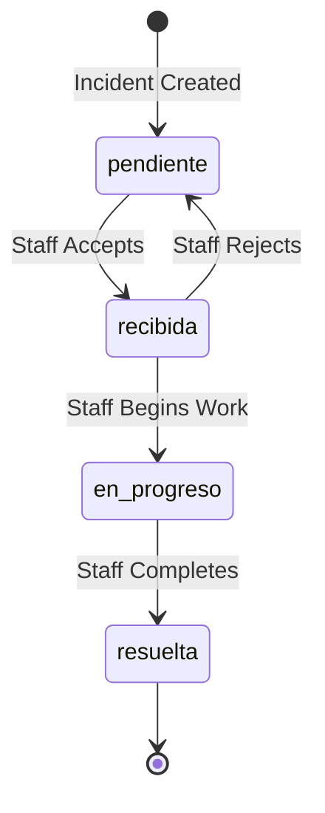

The `incidents` table stores all incident reports submitted by guests or staff members. Each incident is assigned to an area and tracks its resolution status.

## Table Name

`incidents`

## Schema Fields

<ParamField path="id" type="uuid" required>
  Primary key, automatically generated
</ParamField>

<ParamField path="title" type="text" required>
  Brief title of the incident (e.g., "Aire no enfría")
</ParamField>

<ParamField path="description" type="text" required>
  Detailed description of the problem
</ParamField>

<ParamField path="priority" type="enum" required>
  Priority level for the incident
  
  **Allowed values:**
  - `baja` - Low priority
  - `media` - Medium priority
  - `alta` - High priority
</ParamField>

<ParamField path="status" type="text" default="pendiente">
  Current status of the incident
  
  **Common values:**
  - `pendiente` - Awaiting assignment
  - `recibida` - Accepted by staff
  - `en_progreso` - Being worked on
  - `resuelta` - Resolved
</ParamField>

<ParamField path="area_id" type="uuid" required>
  Foreign key reference to `areas.id`. Determines which department handles this incident.
</ParamField>

<ParamField path="room_id" type="uuid" required>
  Foreign key reference to `rooms.id`. Indicates where the incident occurred.
</ParamField>

<ParamField path="assigned_to" type="uuid">
  Foreign key reference to `profiles.id`. The staff member assigned to resolve this incident.
</ParamField>

<ParamField path="created_at" type="timestamp">
  Automatically set when the incident is created
</ParamField>

<ParamField path="updated_at" type="timestamp">
  Automatically updated when the incident is modified
</ParamField>

## Relationships

- **areas**: Many-to-one relationship via `area_id`
- **rooms**: Many-to-one relationship via `room_id`
- **profiles**: Many-to-one relationship via `assigned_to`
- **incident_resolutions**: One-to-many relationship
- **incident_evidence**: One-to-many relationship

## Query Examples

### Create New Incident

Guests create incidents when reporting problems:

```typescript
const { error } = await supabase.from("incidents").insert({
  title: "Aire acondicionado no funciona",
  description: "El aire acondicionado no enfría la habitación",
  priority: "alta",
  area_id: areaId,
  room_id: roomId,
});
```

<Info>
  The `status` field defaults to `"pendiente"` if not specified.
</Info>

### Fetch Incidents for a Room

Retrieve all incidents reported from a specific room:

```typescript
const { data, error } = await supabase
  .from("incidents")
  .select("id, title, description, priority, status, created_at, areas(name)")
  .eq("room_id", roomId)
  .order("created_at", { ascending: false });
```

**Source:** `mobile/components/MyIncidentsView.tsx:106`

### Assign Incident to Staff

When a staff member accepts an incident:

```typescript
const { error } = await supabase
  .from("incidents")
  .update({
    status: "recibida",
    assigned_to: userId,
  })
  .eq("id", incidentId);
```

**Source:** `mobile/app/(guest)/incidents/[id].tsx:147`

### Update Incident Status

Progress an incident from "recibida" to "en_progreso":

```typescript
const { error } = await supabase
  .from("incidents")
  .update({
    status: "en_progreso",
    updated_at: new Date().toISOString(),
  })
  .eq("id", incidentId);
```

**Source:** `mobile/app/(guest)/incidents/[id].tsx:232`

### Load Area-Specific Incidents

Staff members see incidents for their assigned area:

```typescript
const { data, error } = await supabase
  .from("incidents")
  .select(`
    id, title, description, priority, status, created_at, 
    areas(name), 
    rooms(room_code)
  `)
  .eq("status", "pendiente")
  .eq("area_id", areaId)
  .order("created_at", { ascending: false });
```

**Source:** `mobile/components/EmpleadoBuzonIncidents.tsx:207`

### Fetch Incident Details

Retrieve complete incident information including resolutions and evidence:

```typescript
const { data, error } = await supabase
  .from("incidents")
  .select(`
    *, 
    areas(name), 
    rooms(room_code),
    incident_resolutions(description, created_at, resolved_by),
    incident_evidence(image_url)
  `)
  .eq("id", incidentId)
  .single();
```

**Source:** `mobile/app/(guest)/incidents/[id].tsx:84`

### Mark Incident as Resolved

```typescript
await supabase
  .from("incidents")
  .update({ status: "resuelta" })
  .eq("id", incidentId);
```

**Source:** `mobile/components/ResolveIncidentBottomSheet.tsx:201`

## Status Workflow

The incident status follows this typical workflow:



## Priority Levels

<ResponseField name="baja" type="Low Priority">
  Color: Green (#10B981)
  
  Non-urgent issues that can be handled during regular maintenance
</ResponseField>

<ResponseField name="media" type="Medium Priority">
  Color: Amber (#F59E0B)
  
  Issues requiring attention but not immediately critical
</ResponseField>

<ResponseField name="alta" type="High Priority">
  Color: Red (#EF4444)
  
  Critical issues requiring immediate attention
</ResponseField>

## Related Tables

<CardGroup cols={2}>
  <Card title="Incident Resolutions" icon="check" href="/api/incidents">
    Resolution details when incidents are completed
  </Card>
  <Card title="Areas" icon="building" href="/api/areas">
    Department assignments for incidents
  </Card>
  <Card title="Rooms" icon="door-open" href="/api/rooms">
    Room location data
  </Card>
  <Card title="Users" icon="user" href="/api/users">
    Staff member assignments
  </Card>
</CardGroup>
