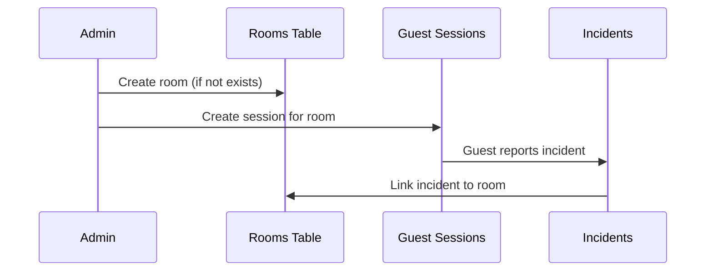

The `rooms` table stores hotel room codes used to identify the location of incidents and link guest sessions to specific rooms.

## Table Name

`rooms`

## Schema Fields

<ParamField path="id" type="uuid" required>
  Primary key, automatically generated
</ParamField>

<ParamField path="room_code" type="text" required>
  Unique room identifier (e.g., "A-203", "B-105")
  
  Room codes are typically formatted as building/floor-number but can use any format.
</ParamField>

<ParamField path="created_at" type="timestamp">
  Automatically set when the room is created
</ParamField>

## Relationships

- **incidents**: One-to-many relationship (one room can have many incidents)
- **guest_sessions**: One-to-many relationship (one room can have many sessions)

## Query Examples

### Create Room

Rooms are typically created on-demand when creating guest sessions:

```typescript
const roomCode = "A-203";

// Check if room exists
const { data: existingRoom } = await supabase
  .from("rooms")
  .select("id")
  .eq("room_code", roomCode)
  .single();

let roomId = existingRoom?.id;

if (!roomId) {
  // Create new room
  const { data: newRoom, error } = await supabase
    .from("rooms")
    .insert({ room_code: roomCode })
    .select("id")
    .single();

  if (error) throw error;
  roomId = newRoom.id;
}
```

**Source:** `mobile/app/(admin)/createSessions.tsx:45`

### Find Room by Code

Lookup a room's ID using its code:

```typescript
const { data: room, error } = await supabase
  .from("rooms")
  .select("id")
  .eq("room_code", roomCode)
  .single();
```

### Get Room Code from ID

When displaying incident details, fetch the room code:

```typescript
const { data, error } = await supabase
  .from("incidents")
  .select(`
    *,
    rooms(room_code)
  `)
  .eq("id", incidentId)
  .single();

console.log(data.rooms.room_code); // "A-203"
```

**Source:** `mobile/components/EmpleadoBuzonIncidents.tsx:208`

### List All Rooms

Retrieve all room codes:

```typescript
const { data: rooms, error } = await supabase
  .from("rooms")
  .select("id, room_code")
  .order("room_code");
```

### Get Room Information

Fetch complete room details from guest session:

```typescript
const { data: session, error } = await supabase
  .from("guest_sessions")
  .select(`
    *,
    rooms(room_code)
  `)
  .eq("access_code", accessCode)
  .single();

console.log(session.rooms.room_code);
```

**Source:** `mobile/components/settings/guest/StayInfoModal.tsx:60`

## Room Code Format

<Info>
  Room codes are free-form text and can follow any naming convention. Common patterns include:
  - Building-Number: `"A-203"`, `"B-105"`
  - Floor-Number: `"2-203"`, `"1-105"`  
  - Simple Numbers: `"203"`, `"105"`
</Info>

## Usage Pattern

The typical room lifecycle:



## Example: Room Creation Flow

When an admin creates a guest session:

```typescript
async function createGuestSession(roomCode: string, expiresAt: Date) {
  // Step 1: Check if room exists
  const { data: existingRoom } = await supabase
    .from("rooms")
    .select("id")
    .eq("room_code", roomCode)
    .single();

  let roomId = existingRoom?.id;

  // Step 2: Create room if needed
  if (!roomId) {
    const { data: newRoom, error } = await supabase
      .from("rooms")
      .insert({ room_code: roomCode })
      .select("id")
      .single();

    if (error) throw error;
    roomId = newRoom.id;
  }

  // Step 3: Create guest session linked to room
  const accessCode = generateAccessCode();
  
  const { error } = await supabase.from("guest_sessions").insert({
    room_id: roomId,
    access_code: accessCode,
    expires_at: expiresAt.toISOString(),
    active: true,
  });

  if (error) throw error;
  
  return { roomId, accessCode };
}
```

**Source:** `mobile/app/(admin)/createSessions.tsx:37`

## Data Model

```typescript
interface Room {
  id: string;           // UUID
  room_code: string;    // e.g., "A-203"
  created_at: string;   // ISO timestamp
}
```

## Design Considerations

<Check>
  - Room codes are unique to prevent duplicate entries
  - Rooms are created lazily (on-demand) when needed
  - Room codes are case-sensitive
  - Old room codes persist for historical incident records
</Check>

## Related Tables

<CardGroup cols={2}>
  <Card title="Incidents" icon="triangle-exclamation" href="/api/incidents">
    Incidents linked to room locations
  </Card>
  <Card title="Guest Sessions" icon="key" href="/api/sessions">
    Guest access sessions per room
  </Card>
</CardGroup>
