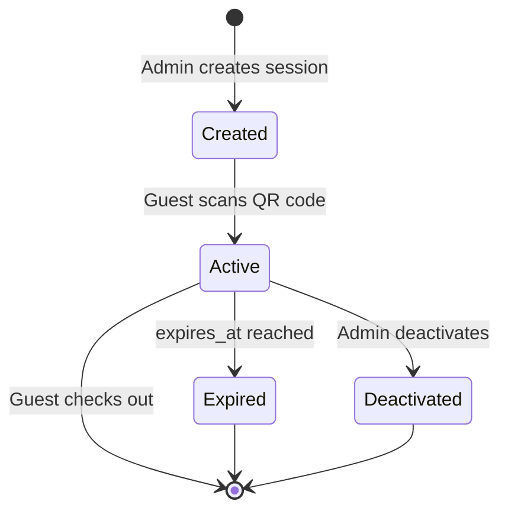

The `guest_sessions` table manages temporary access for hotel guests, enabling them to report incidents without creating permanent accounts.

## Table Name

`guest_sessions`

## Schema Fields

<ParamField path="id" type="uuid" required>
  Primary key, automatically generated
</ParamField>

<ParamField path="room_id" type="uuid" required>
  Foreign key reference to `rooms.id`. Links the session to a specific hotel room.
</ParamField>

<ParamField path="access_code" type="text" required>
  Unique access code for guest authentication (e.g., "ABCD-1234")
  
  Generated as an 8-character alphanumeric code formatted with a hyphen.
</ParamField>

<ParamField path="expires_at" type="timestamp" required>
  Expiration date/time for the session. After this time, the guest can no longer access the system.
</ParamField>

<ParamField path="active" type="boolean" default="true">
  Whether the session is currently active. Admins can manually deactivate sessions.
</ParamField>

<ParamField path="created_at" type="timestamp">
  Automatically set when the session is created
</ParamField>

## Relationships

- **rooms**: Many-to-one relationship via `room_id`
- **incidents**: Logical relationship (incidents are created with the session's `room_id`)

## Access Code Format

Access codes are generated with this pattern:

```typescript
function generateAccessCode() {
  const chars = "ABCDEFGHJKLMNPQRSTUVWXYZ23456789";
  let code = "";
  for (let i = 0; i < 8; i++) {
    code += chars[Math.floor(Math.random() * chars.length)];
  }
  return code.match(/.{1,4}/g)?.join("-") ?? code;
}
// Example output: "ABCD-1234"
```

**Source:** `mobile/app/(admin)/createSessions.tsx:19`

<Info>
  Access codes exclude ambiguous characters (0, O, 1, I, L) to prevent confusion when manually entering codes.
</Info>

## Query Examples

### Create Guest Session

Admins create sessions for new hotel guests:

```typescript
const accessCode = generateAccessCode();
const expiresAt = new Date("2024-12-31T12:00:00");

const { error } = await supabase.from("guest_sessions").insert({
  room_id: roomId,
  access_code: accessCode,
  expires_at: expiresAt.toISOString(),
  active: true,
});
```

**Source:** `mobile/app/(admin)/createSessions.tsx:71`

### Validate Access Code

When a guest scans a QR code or enters an access code:

```typescript
const { data: session, error } = await supabase
  .from("guest_sessions")
  .select(`
    *,
    rooms(room_code)
  `)
  .eq("access_code", accessCode)
  .single();

if (!session) {
  throw new Error("Invalid access code");
}

if (new Date(session.expires_at) < new Date()) {
  throw new Error("Session expired");
}

if (!session.active) {
  throw new Error("Session deactivated");
}
```

**Source:** `mobile/app/(guestScan)/scan.tsx:59`

### Fetch Session Details

Retrieve session information for the currently logged-in guest:

```typescript
import * as SecureStore from "expo-secure-store";

const raw = await SecureStore.getItemAsync("guest_session");
if (!raw) throw new Error("No guest session");

const guestSession = JSON.parse(raw);

const { data: session, error } = await supabase
  .from("guest_sessions")
  .select(`
    access_code,
    expires_at,
    created_at,
    rooms(room_code)
  `)
  .eq("id", guestSession.id)
  .single();
```

**Source:** `mobile/components/settings/guest/StayInfoModal.tsx:60`

### Get Incidents for Session Room

Load all incidents reported by a guest:

```typescript
const raw = await SecureStore.getItemAsync("guest_session");
const guestSession = JSON.parse(raw);

const { data: incidents, error } = await supabase
  .from("incidents")
  .select(`
    id, 
    title, 
    description, 
    priority, 
    status, 
    created_at,
    areas(name)
  `)
  .eq("room_id", guestSession.room_id)
  .order("created_at", { ascending: false });
```

**Source:** `mobile/components/MyIncidentsView.tsx:106`

## QR Code Integration

Sessions support QR code access for easy mobile scanning:

```typescript
import QRCode from "react-native-qrcode-svg";

const qrValue = JSON.stringify({
  room_code: roomCode,
  access_code: accessCode,
});

<QRCode value={qrValue} size={180} />
```

**Source:** `mobile/app/(admin)/createSessions.tsx:86`

## Session Lifecycle



## Session Validation

When a guest attempts to access the system:

```typescript
function validateSession(session: GuestSession): boolean {
  // Check if session exists
  if (!session) return false;
  
  // Check if active
  if (!session.active) return false;
  
  // Check if expired
  const now = new Date();
  const expiresAt = new Date(session.expires_at);
  if (expiresAt < now) return false;
  
  return true;
}
```

## Data Model

```typescript
interface GuestSession {
  id: string;           // UUID
  room_id: string;      // UUID (foreign key)
  access_code: string;  // e.g., "ABCD-1234"
  expires_at: string;   // ISO timestamp
  active: boolean;      // true/false
  created_at: string;   // ISO timestamp
}
```

## Storage in Mobile App

The guest session is stored locally using Expo SecureStore:

```typescript
import * as SecureStore from "expo-secure-store";

// Store session
await SecureStore.setItemAsync(
  "guest_session",
  JSON.stringify({
    id: session.id,
    room_id: session.room_id,
    access_code: session.access_code,
  })
);

// Retrieve session
const raw = await SecureStore.getItemAsync("guest_session");
if (raw) {
  const guestSession = JSON.parse(raw);
  console.log(guestSession.room_id);
}
```

**Source:** `mobile/components/CreateIncidentForm.tsx:107`

## Admin Workflow

Typical flow when creating a guest session:

1. Admin enters room code (e.g., "A-203")
2. Admin selects expiration date/time (typically checkout date)
3. System checks if room exists, creates if needed
4. System generates unique access code
5. System creates guest session record
6. Admin shows QR code to guest or provides access code

```typescript
async function createGuestSession(roomCode: string, expiresAt: Date) {
  // Find or create room
  const { data: existingRoom } = await supabase
    .from("rooms")
    .select("id")
    .eq("room_code", roomCode)
    .single();

  let roomId = existingRoom?.id;

  if (!roomId) {
    const { data: newRoom } = await supabase
      .from("rooms")
      .insert({ room_code: roomCode })
      .select("id")
      .single();
    roomId = newRoom.id;
  }

  // Generate access code
  const accessCode = generateAccessCode();

  // Create session
  await supabase.from("guest_sessions").insert({
    room_id: roomId,
    access_code: accessCode,
    expires_at: expiresAt.toISOString(),
    active: true,
  });

  return { roomId, accessCode };
}
```

**Source:** `mobile/app/(admin)/createSessions.tsx:37`

## Security Considerations

<Warning>
  - Sessions should expire after guest checkout
  - Access codes should be unique and unpredictable
  - Validate both `active` flag and `expires_at` timestamp
  - Implement rate limiting on access code validation
  - Consider deactivating old sessions periodically
</Warning>

## Best Practices

<Tip>
  - Set expiration to checkout date + 1 day
  - Generate QR codes for contactless access
  - Store session data securely in mobile app (SecureStore)
  - Display clear expiration information to guests
  - Provide manual code entry as fallback to QR scanning
</Tip>

## Related Tables

<CardGroup cols={2}>
  <Card title="Rooms" icon="door-open" href="/api/rooms">
    Room assignments for sessions
  </Card>
  <Card title="Incidents" icon="triangle-exclamation" href="/api/incidents">
    Incidents reported during sessions
  </Card>
</CardGroup>
