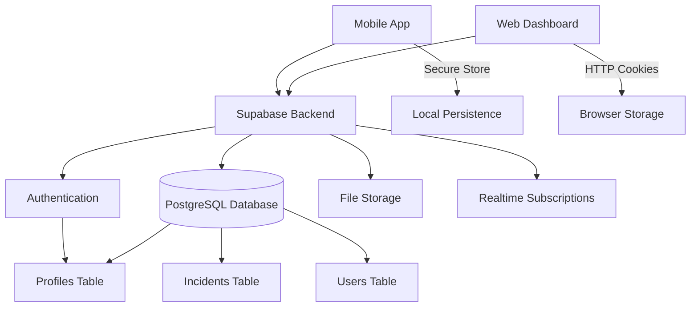

## System Overview

The Incidents App is built as a **monorepo** containing two distinct but interconnected applications:

<CardGroup cols={2}>
  <Card title="Mobile App" icon="mobile-screen">
    React Native app built with Expo, supporting iOS, Android, and Web platforms
  </Card>
  <Card title="Web Dashboard" icon="chart-line">
    Next.js admin dashboard with advanced analytics and management features
  </Card>
</CardGroup>

Both applications share a common backend powered by **Supabase**, providing authentication, real-time database, and storage capabilities.

## Monorepo Structure

```
incidents-app/
├── mobile/                 # React Native + Expo mobile application
│   ├── app/               # File-based routing (Expo Router)
│   │   ├── (admin)/       # Admin-only routes
│   │   ├── (empleado)/    # Employee routes
│   │   ├── (guest)/       # Guest user routes
│   │   ├── (guestScan)/   # QR scanning for guests
│   │   └── (auth)/        # Authentication flows
│   ├── assets/            # Images, fonts, and static files
│   ├── components/        # Reusable UI components
│   ├── hooks/             # Custom React hooks
│   └── src/
│       ├── services/      # API and service layer
│       │   └── supabase.ts
│       └── context/       # React context providers
│
└── web/                   # Next.js web dashboard
    ├── app/               # App Router structure
    │   ├── (dashboard)/   # Protected dashboard routes
    │   ├── globals.css    # Global styles
    │   ├── layout.tsx     # Root layout
    │   └── page.tsx       # Login page
    ├── components/        # React components
    ├── lib/               # Utility functions and clients
    │   └── supabase.ts    # Supabase browser client
    ├── hooks/             # Custom hooks
    ├── middleware.ts      # Next.js middleware for auth
    └── public/            # Static assets
```

<Info>
  The monorepo structure allows shared configuration and dependencies while maintaining separation between mobile and web codebases.
</Info>

## Mobile App Architecture

### Technology Stack

The mobile app leverages modern React Native technologies:

```json mobile/package.json
{
  "dependencies": {
    "expo": "~54.0.32",
    "expo-router": "~6.0.22",
    "react-native": "0.81.5",
    "@supabase/supabase-js": "^2.91.0",
    "expo-secure-store": "~15.0.8",
    "react-native-reanimated": "~4.1.1",
    "lucide-react-native": "^0.563.0"
  }
}
```

### File-Based Routing

The mobile app uses **Expo Router** for file-based navigation with route groups:

<CodeGroup>
```typescript app/_layout.tsx
import { Stack } from "expo-router";
import { useFonts } from "expo-font";
import {
  Poppins_400Regular,
  Poppins_500Medium,
  Poppins_600SemiBold,
  Poppins_700Bold,
} from "@expo-google-fonts/poppins";

export default function RootLayout() {
  const [loaded] = useFonts({
    DtmF: require("../assets/fonts/DebiUsarEsteFontRegular.ttf"),
    PoppinsRegular: Poppins_400Regular,
    PoppinsMedium: Poppins_500Medium,
    PoppinsSemiBold: Poppins_600SemiBold,
    PoppinsBold: Poppins_700Bold,
  });

  if (!loaded) return null;

  return <Stack screenOptions={{ headerShown: false }} />;
}
```

```typescript app/index.tsx
import { supabase } from "@/src/services/supabase";
import { router } from "expo-router";
import * as SecureStore from "expo-secure-store";

export default function SplashScreen() {
  useEffect(() => {
    const bootstrap = async () => {
      const { data } = await supabase.auth.getSession();

      if (data.session) {
        const { data: profile } = await supabase
          .from("profiles")
          .select("role")
          .eq("id", data.session.user.id)
          .single();

        if (profile?.role === "admin") {
          router.replace("/(admin)");
          return;
        }

        if (profile?.role === "empleado") {
          router.replace("/(empleado)");
          return;
        }
      }

      const guestSession = await SecureStore.getItemAsync("guest_session");
      if (guestSession) {
        router.replace("/(guest)/home");
      } else {
        router.replace("/(auth)/login");
      }
    };

    bootstrap();
  }, []);
}
```
</CodeGroup>

### Route Groups

The app uses parentheses `()` to create route groups without affecting the URL structure:

- **(admin)/** - Admin dashboard, user management, session creation
- **(empleado)/** - Employee incident management
- **(guest)/** - Guest incident tracking
- **(guestScan)/** - QR code scanning for quick incident reporting
- **(auth)/** - Login and authentication flows

<Note>
  Route groups in Expo Router allow logical organization without impacting the navigation hierarchy.
</Note>

### Supabase Integration (Mobile)

The mobile app uses Expo Secure Store for persistent authentication:

```typescript mobile/src/services/supabase.ts
import { createClient } from '@supabase/supabase-js'
import * as SecureStore from 'expo-secure-store'

const supabaseUrl = process.env.EXPO_PUBLIC_SUPABASE_URL as string
const supabaseAnonKey = process.env.EXPO_PUBLIC_SUPABASE_ANON_KEY as string

const ExpoSecureStoreAdapter = {
    getItem: SecureStore.getItemAsync,
    setItem: SecureStore.setItemAsync,
    removeItem: SecureStore.deleteItemAsync
}

export const supabase = createClient(
    supabaseUrl,
    supabaseAnonKey,
    {
        auth: {
            storage: ExpoSecureStoreAdapter,
            persistSession: true,
            autoRefreshToken: true,
            detectSessionInUrl: false
        }
    }
)
```

<Info>
  **Key Features:**
  - Secure token storage using device keychain/keystore
  - Automatic session refresh
  - Persistent authentication across app restarts
  - No session detection from URLs (mobile-specific)
</Info>

## Web Dashboard Architecture

### Technology Stack

The web dashboard uses Next.js 16 with the App Router:

```json web/package.json
{
  "dependencies": {
    "next": "16.1.6",
    "react": "19.2.3",
    "@supabase/ssr": "^0.8.0",
    "@supabase/supabase-js": "^2.95.3",
    "@tanstack/react-table": "^8.21.3",
    "recharts": "2.15.4",
    "lucide-react": "^0.575.0",
    "next-themes": "^0.4.6",
    "tailwindcss": "^4"
  }
}
```

### App Router Structure

```typescript web/app/layout.tsx
import type { Metadata } from "next";
import "./globals.css";

export const metadata: Metadata = {
  title: "Amanera - Incidents Dashboard",
  description: "Admin dashboard for incident management",
};

export default function RootLayout({
  children,
}: Readonly<{
  children: React.ReactNode;
}>) {
  return (
    <html lang="en">
      <body>{children}</body>
    </html>
  );
}
```

### Supabase Integration (Web)

The web app uses Supabase SSR for server-side authentication:

```typescript web/lib/supabase.ts
import { createBrowserClient } from "@supabase/ssr";

const supabaseUrl = process.env.NEXT_PUBLIC_SUPABASE_URL;
const supabaseAnonKey = process.env.NEXT_PUBLIC_SUPABASE_ANON_KEY;

if (!supabaseUrl || !supabaseAnonKey) {
    throw new Error("Missing Supabase environment variables");
}

export const supabase = createBrowserClient(supabaseUrl, supabaseAnonKey);
```

<Warning>
  The web client throws an error if environment variables are missing, ensuring configuration issues are caught early.
</Warning>

### Middleware for Authentication

Next.js middleware protects dashboard routes:

```typescript web/middleware.ts
import { NextRequest, NextResponse } from "next/server";

/**
 * Lightweight middleware that checks if a Supabase auth cookie is present
 * before allowing access to /dashboard routes.
 * Full role validation happens server-side in the dashboard page itself.
 */
export function middleware(request: NextRequest) {
    const { pathname } = request.nextUrl;

    if (pathname.startsWith("/dashboard")) {
        // Supabase persists the session in a cookie named "sb-<project>-auth-token"
        const hasSession = Array.from(request.cookies.getAll()).some(
            (c) => c.name.startsWith("sb-") && c.name.endsWith("-auth-token")
        );

        if (!hasSession) {
            return NextResponse.redirect(new URL("/", request.url));
        }
    }

    return NextResponse.next();
}

export const config = {
    matcher: ["/dashboard/:path*"],
};
```

<Info>
  **Two-Layer Security:**
  1. **Middleware**: Fast cookie-based check (edge runtime)
  2. **Page Level**: Full role validation with database queries (server component)
</Info>

## Authentication Flow

The system implements a unified authentication strategy across both platforms:

<Steps>
  <Step title="Initial Check">
    On app startup, check for existing session:
    - Mobile: Query Secure Store
    - Web: Check HTTP-only cookies
  </Step>

  <Step title="Session Validation">
    If session exists, validate with Supabase and fetch user profile:
    
    ```typescript
    const { data } = await supabase.auth.getSession();
    const { data: profile } = await supabase
      .from("profiles")
      .select("role")
      .eq("id", data.session.user.id)
      .single();
    ```
  </Step>

  <Step title="Role-Based Routing">
    Route user to appropriate interface based on role:
    - **admin**: Full access to admin features
    - **empleado**: Employee incident management
    - **guest**: Limited guest access via QR code
  </Step>

  <Step title="Authorization Guard">
    For protected actions, verify role server-side before executing:
    
    ```typescript web/app/page.tsx
    const { data: profile, error: profileError } = await supabase
      .from("profiles")
      .select("role")
      .eq("id", data.user.id)
      .single();

    if (profileError || profile?.role !== "admin") {
      await supabase.auth.signOut();
      throw new Error("Acceso denegado. Solo administradores pueden ingresar.");
    }
    ```
  </Step>
</Steps>

## Data Flow Diagram



## Key Configuration Files

### Mobile Configuration

```json mobile/app.json
{
  "expo": {
    "name": "incidents-app",
    "slug": "incidents-app",
    "version": "1.0.0",
    "scheme": "fluxomobile",
    "newArchEnabled": true,
    "plugins": [
      "expo-router",
      "react-native-bottom-tabs",
      "expo-secure-store",
      "expo-barcode-scanner"
    ],
    "experiments": {
      "typedRoutes": true,
      "reactCompiler": true
    }
  }
}
```

<Tip>
  **Notable Features:**
  - React Native New Architecture enabled
  - Typed routes for type-safe navigation
  - React Compiler for performance optimization
</Tip>

### Web Configuration

```typescript web/next.config.ts
import type { NextConfig } from "next";

const nextConfig: NextConfig = {
  // Configuration options
};

export default nextConfig;
```

## State Management

Both applications use minimal state management approaches:

- **React Context**: For global auth state
- **Local State**: Component-level with `useState` and `useReducer`
- **Server State**: Direct Supabase queries (no caching layer needed due to real-time subscriptions)

<Info>
  The architecture favors simplicity and leverages Supabase's real-time features instead of complex state management libraries.
</Info>

## Styling Approaches

<CardGroup cols={2}>
  <Card title="Mobile" icon="palette">
    - React Native StyleSheet
    - Inline styles
    - Custom theme system
    - Expo Linear Gradient
  </Card>
  <Card title="Web" icon="paintbrush">
    - Tailwind CSS v4
    - CSS Modules
    - shadcn/ui components
    - Dark mode support
  </Card>
</CardGroup>

## Performance Considerations

### Mobile Optimizations

- **Reanimated**: Smooth 60fps animations running on UI thread
- **FlashList**: High-performance list rendering
- **Image Optimization**: Expo Image for lazy loading and caching
- **Code Splitting**: Route-based with Expo Router

### Web Optimizations

- **Server Components**: Default in Next.js App Router
- **Streaming**: Progressive page rendering
- **Static Generation**: Where applicable
- **Edge Middleware**: Fast authentication checks

## Security Architecture

<Warning>
  **Security Layers:**
  
  1. **Environment Variables**: Never expose secrets client-side
  2. **Row Level Security**: Supabase RLS policies on all tables
  3. **Middleware Guards**: Pre-render authentication checks
  4. **Server Validation**: Never trust client data
  5. **Secure Storage**: Keychain/Keystore for mobile, HTTP-only cookies for web
</Warning>

## Deployment Architecture

The recommended deployment strategy:

- **Mobile**: Expo Application Services (EAS) for build and distribution
- **Web**: Vercel or similar Next.js-optimized platform
- **Backend**: Supabase hosted or self-hosted instance
- **Assets**: Supabase Storage or CDN

## Next Steps

Now that you understand the architecture:

- Set up your development environment with the [Quick Start](/quickstart)
- Configure Supabase database tables and RLS policies
- Customize the UI components for your brand
- Deploy to production platforms

<Tip>
  Review the Expo Router and Next.js App Router documentation for deeper understanding of the routing systems.
</Tip>