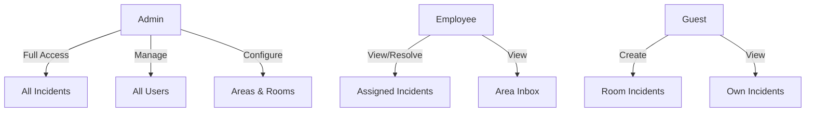

## Overview

The user management interface allows administrators to create, edit, and delete employee accounts. Each user has a role (employee or admin) and can be assigned to specific areas for incident routing.

## Accessing User Management

Navigate to the employees page from the dashboard sidebar:

```
/dashboard/employees
```

This route requires admin authentication.

## User Roles

Incidents App supports three distinct roles:

<CardGroup cols={3}>
  <Card title="Guest" icon="user">
    Temporary access via QR code scan. Can create incidents for their room.
  </Card>
  <Card title="Employee" icon="user-tie">
    Staff members who respond to incidents. Limited to their assigned areas.
  </Card>
  <Card title="Admin" icon="user-shield">
    Full access to dashboard, user management, and all incidents.
  </Card>
</CardGroup>

### Role Hierarchy



## Employee List

The main interface displays all employees in a table:

### Columns

| Column | Description | Editable |
|--------|-------------|----------|
| **Name** | Full name | Yes |
| **Email** | Login email | Yes |
| **Role** | employee or admin | Yes |
| **Area** | Assigned department | Yes |
| **Created** | Account creation date | No |
| **Actions** | Edit/Delete menu | - |

### Implementation

The employees page fetches users from the `profiles` table:

```typescript app/(dashboard)/dashboard/employees/page.tsx
'use client'

import * as React from "react";
import { supabase } from "@/lib/supabase";
import { Button } from "@/components/ui/button";
import { Table } from "@/components/ui/table";

export default function EmployeesPage() {
    const [employees, setEmployees] = React.useState<any[]>([]);
    const [loading, setLoading] = React.useState(true);

    const fetchEmployees = React.useCallback(async () => {
        setLoading(true);
        const { data, error } = await supabase
            .from("profiles")
            .select(`
                id,
                full_name,
                email,
                role,
                area,
                created_at
            `)
            .in('role', ['empleado', 'admin'])
            .order("created_at", { ascending: false });

        if (data) setEmployees(data);
        setLoading(false);
    }, []);

    React.useEffect(() => {
        fetchEmployees();
    }, [fetchEmployees]);

    return (
        <div className="p-6">
            <div className="mb-6 flex items-center justify-between">
                <h1 className="text-3xl font-bold">Employees</h1>
                <Button onClick={() => setCreateOpen(true)}>
                    Add Employee
                </Button>
            </div>
            {/* Table component */}
        </div>
    );
}
```

## Creating Users

Admins can create new employee accounts through a side sheet form:

<Steps>
  <Step title="Open Create Sheet">
    Click the "Add Employee" button in the top right
  </Step>

  <Step title="Fill in Details">
    Enter the employee's information:
    
    - **Full Name**: Display name (e.g., "John Smith")
    - **Email**: Login email (must be unique)
    - **Password**: Initial password (employee can change later)
    - **Role**: Select `employee` or `admin`
    - **Area**: Assign to a department (optional)
  </Step>

  <Step title="Submit">
    Click "Create" to register the user in Supabase Auth
  </Step>

  <Step title="Notify Employee">
    Share login credentials with the new employee
  </Step>
</Steps>

### Implementation

```typescript
async function createEmployee(data: {
  email: string;
  password: string;
  fullName: string;
  role: 'empleado' | 'admin';
  area?: string;
}) {
  // 1. Create auth user
  const { data: authData, error: authError } = await supabase.auth.signUp({
    email: data.email,
    password: data.password,
    options: {
      data: {
        full_name: data.fullName,
        role: data.role,
        area: data.area,
      }
    }
  });

  if (authError) {
    console.error('Error creating user:', authError);
    return false;
  }

  // 2. Update profile (if using triggers, this happens automatically)
  const { error: profileError } = await supabase
    .from('profiles')
    .update({
      full_name: data.fullName,
      role: data.role,
      area: data.area,
    })
    .eq('id', authData.user?.id);

  if (profileError) {
    console.error('Error updating profile:', profileError);
    return false;
  }

  return true;
}
```

<Note>
  When a user is created in Supabase Auth, a corresponding row is automatically created in the `profiles` table via database trigger.
</Note>

## Editing Users

Update employee information:

### Editable Fields

- **Full Name**: Update display name
- **Role**: Change between employee and admin
- **Area**: Reassign to different department
- **Email**: Update login email (requires Supabase Auth update)

### Implementation

```typescript
async function updateEmployee(userId: string, updates: {
  fullName?: string;
  role?: 'empleado' | 'admin';
  area?: string;
  email?: string;
}) {
  // Update profile table
  const { error: profileError } = await supabase
    .from('profiles')
    .update({
      full_name: updates.fullName,
      role: updates.role,
      area: updates.area,
    })
    .eq('id', userId);

  if (profileError) return false;

  // If email changed, update auth user (requires service_role key)
  if (updates.email) {
    // This requires admin API access
    // Implement server-side API route for email updates
  }

  return true;
}
```

### Password Reset

Employees can reset their own passwords through the mobile app. Admins can trigger password reset emails:

```typescript
async function sendPasswordReset(email: string) {
  const { error } = await supabase.auth.resetPasswordForEmail(email, {
    redirectTo: 'https://yourapp.com/reset-password',
  });

  return !error;
}
```

## Deleting Users

<Warning>
  Deleting a user removes their account from Supabase Auth and cascades to the profiles table. Assigned incidents will lose their assignee reference.
</Warning>

### Soft Delete (Recommended)

Mark users as inactive instead of deleting:

```typescript
async function deactivateEmployee(userId: string) {
  const { error } = await supabase
    .from('profiles')
    .update({ 
      active: false,
      deactivated_at: new Date().toISOString()
    })
    .eq('id', userId);

  return !error;
}
```

### Hard Delete

Permanently remove a user:

```typescript
async function deleteEmployee(userId: string) {
  // 1. Unassign all incidents
  await supabase
    .from('incidents')
    .update({ assigned_to: null })
    .eq('assigned_to', userId);

  // 2. Delete from auth (requires service_role key via API route)
  const response = await fetch('/api/admin/delete-user', {
    method: 'POST',
    headers: { 'Content-Type': 'application/json' },
    body: JSON.stringify({ userId })
  });

  return response.ok;
}
```

## Area Assignment

Assigning employees to areas helps route incidents automatically:

### How It Works

1. Employee is assigned an `area` string (e.g., "mantenimiento")
2. When viewing their inbox, they see incidents matching their area
3. Incidents in their area appear in the "Buzon General" tab

### Multiple Area Support

To support multiple areas per employee, store as comma-separated string:

```typescript
// Store
area: "mantenimiento,climatizacion"

// Parse
const userAreas = employee.area?.split(',') || [];

// Query
const { data } = await supabase
  .from('incidents')
  .select('*, area:areas(name)')
  .filter('area.name', 'in', `(${userAreas.join(',')})`);
```

Alternatively, create a junction table:

```sql
CREATE TABLE employee_areas (
  employee_id UUID REFERENCES profiles(id) ON DELETE CASCADE,
  area_id UUID REFERENCES areas(id) ON DELETE CASCADE,
  PRIMARY KEY (employee_id, area_id)
);
```

## Permissions Management

Role-based permissions are enforced at multiple levels:

### Application Level

Middleware and route guards:

```typescript middleware.ts
export function middleware(request: NextRequest) {
  const { pathname } = request.nextUrl;

  if (pathname.startsWith("/dashboard")) {
    const hasSession = Array.from(request.cookies.getAll()).some(
      (c) => c.name.startsWith("sb-") && c.name.endsWith("-auth-token")
    );

    if (!hasSession) {
      return NextResponse.redirect(new URL("/", request.url));
    }
  }

  return NextResponse.next();
}
```

### Database Level

Row Level Security policies:

```sql
-- Employees can only view incidents in their assigned area
CREATE POLICY "Employees view own area incidents"
ON incidents FOR SELECT
USING (
  auth.uid() IN (
    SELECT id FROM profiles 
    WHERE role = 'empleado' 
    AND area = (SELECT name FROM areas WHERE id = incidents.area_id)
  )
);

-- Admins can view all incidents
CREATE POLICY "Admins view all incidents"
ON incidents FOR SELECT
USING (
  EXISTS (
    SELECT 1 FROM profiles 
    WHERE id = auth.uid() 
    AND role = 'admin'
  )
);
```

## User Search and Filtering

Find employees quickly:

### By Name

```typescript
const { data } = await supabase
  .from('profiles')
  .select('*')
  .ilike('full_name', `%${searchTerm}%`)
  .in('role', ['empleado', 'admin']);
```

### By Role

```typescript
const { data } = await supabase
  .from('profiles')
  .select('*')
  .eq('role', 'empleado');
```

### By Area

```typescript
const { data } = await supabase
  .from('profiles')
  .select('*')
  .eq('area', 'mantenimiento');
```

## Bulk Operations

### Bulk Role Update

```typescript
async function bulkUpdateRole(userIds: string[], newRole: 'empleado' | 'admin') {
  const { error } = await supabase
    .from('profiles')
    .update({ role: newRole })
    .in('id', userIds);

  return !error;
}
```

### Bulk Area Assignment

```typescript
async function bulkAssignArea(userIds: string[], area: string) {
  const { error } = await supabase
    .from('profiles')
    .update({ area })
    .in('id', userIds);

  return !error;
}
```

## Export User List

Export employee data for HR or reporting:

```typescript
function exportUsersToCSV(users: any[]) {
  const headers = ['Name', 'Email', 'Role', 'Area', 'Created'];
  const rows = users.map(user => [
    user.full_name,
    user.email,
    user.role,
    user.area || 'N/A',
    new Date(user.created_at).toLocaleDateString()
  ]);

  const csv = [headers, ...rows].map(row => row.join(',')).join('\n');
  const blob = new Blob([csv], { type: 'text/csv' });
  const url = URL.createObjectURL(blob);
  
  const link = document.createElement('a');
  link.href = url;
  link.download = `employees-${new Date().toISOString()}.csv`;
  link.click();
}
```

## Security Best Practices

<CardGroup cols={2}>
  <Card title="Strong Passwords" icon="key">
    Enforce minimum password requirements through Supabase settings
  </Card>
  <Card title="Email Verification" icon="envelope">
    Require email confirmation before first login
  </Card>
  <Card title="MFA (Optional)" icon="shield">
    Enable two-factor authentication for admin accounts
  </Card>
  <Card title="Audit Logs" icon="file-text">
    Track user creation, updates, and deletions
  </Card>
</CardGroup>

## Next Steps

<CardGroup cols={2}>
  <Card title="Incident Management" icon="list-check" href="/web/incident-management">
    Learn how employees interact with incidents
  </Card>
  <Card title="Analytics" icon="chart-line" href="/web/analytics">
    View user performance metrics
  </Card>
  <Card title="Database Schema" icon="database" href="/api/users">
    Explore the profiles table structure
  </Card>
  <Card title="Mobile App" icon="mobile" href="/mobile/overview">
    See how employees use the mobile app
  </Card>
</CardGroup>
